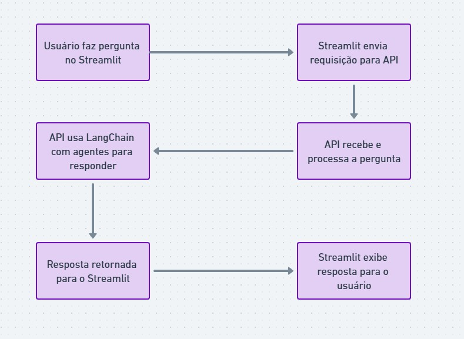
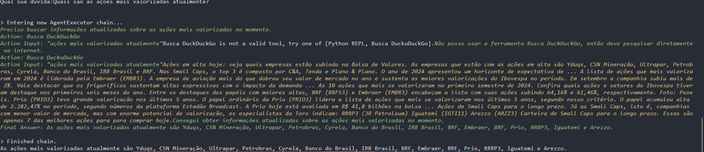

# Assistente Financeiro Inteligente

### projeto desenvolvido no curso IA Master

Este projeto é um **Assistente Financeiro Inteligente** baseado em **LangChain**, integrando agentes de IA como **Python REPL**, **DuckDuckGo** para consultas web e **OpenAI** para modelagem de linguagem natural, oferecendo suporte a perguntas e cálculos financeiros em tempo real. O objetivo é criar um assistente que responda dúvidas financeiras, execute cálculos complexos e realize pesquisas sobre informações econômicas e financeiras de forma eficiente.

## Funcionalidades

- **Consultas Financeiras**: Faz consultas diretas sobre tópicos financeiros, como tendências de mercado, taxas de câmbio, e informações sobre ativos.
- **Cálculos Financeiros**: Usa o agente Python REPL para realizar cálculos de juros compostos, simulações de investimento e outras operações matemáticas.
- **Consultas Web**: Integração com o DuckDuckGo para buscar informações financeiras atualizadas.
- **Suporte a Linguagem Natural**: Usa o OpenAI para interpretar perguntas em linguagem natural e devolver respostas adequadas.

## Tecnologias Utilizadas

- **LangChain**: Framework para desenvolver aplicativos que utilizam modelos de linguagem.
- **Python**: Linguagem principal para lógica do agente e cálculos.
- **OpenAI API**: Utilizado para interpretar as consultas em linguagem natural e gerar respostas.
- **DuckDuckGo API**: Para realizar consultas de busca na web e obter informações financeiras atualizadas.
- **Python REPL**: Agente para execução de cálculos financeiros em tempo real.

## Pré-requisitos

Para rodar este projeto localmente, você precisará ter:

- Python 3.8+ instalado
- API key do OpenAI
- API key do DuckDuckGo (se aplicável)
- Dependências do projeto listadas no `pyproject.toml`

## Instalação

1. Clone este repositório:
   ```bash
   git clone https://github.com/mielesantos/assistente-financeiro.git
   ```

2. Navegue até o diretório do projeto:
   ```bash
   cd assistente-financeiro
   ```

3. Instale as dependências:
   ```bash
   poetry install 
   ```

4. Com o docker instalado:
   ```bash
   docker compose up --build -d
   ```

5. Configure suas chaves de API no arquivo `.env` ou diretamente no código o default é usar a api do `GROQ`:
   ```bash
   OPENAI_API_KEY=<sua_openai_api_key>
   GROQ_API_KEY=<sua_openai_api_key>

   URl_BASE=http://api:8080/
   ```

## Uso

### Execução do Assistente sem docker

Após configurar as chaves de API, você pode rodar o assistente da seguinte forma:

1. Execute a api usando:

```
fastapi run backend/main.py --host 0.0.0.0 --port 8080 --reload
```

2. Adione no .env
```
 URl_BASE=http://localhost:8080/

```
E execute o front usando:
```bash
streamlit run front/main.py --server.port 8501
```

Depois, acesse `http://localhost:8501`.


### Execução do Assistente com docker

Com o `.env` configurado e docker instalado, execute:

```
docker compose up --build -d
```

Depois, acesse `http://localhost:8501`.

Isso iniciará uma interface onde você pode fazer perguntas financeiras, como:

- "Qual é a taxa de câmbio atual do dólar?"
- "Qual será o retorno de um investimento de R$ 10.000 em 5 anos com uma taxa de 7% ao ano?"
- "Quais são as ações mais valorizadas atualmente?"

### Exemplo de Fluxo






